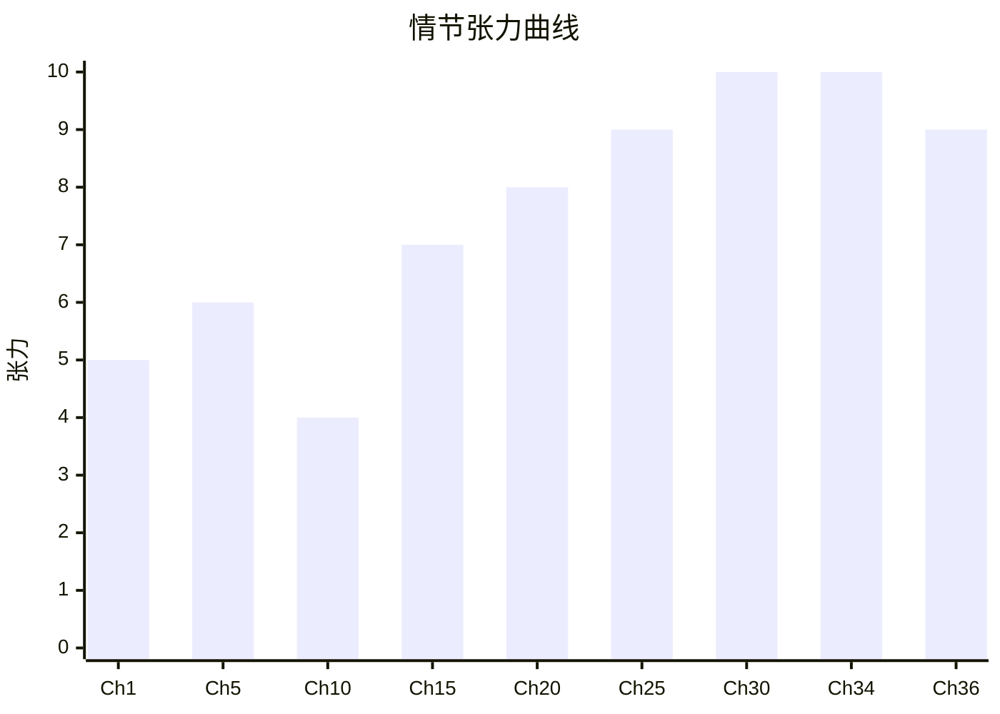

# 📚 终极拆书工作流

**全提示词驱动 · 一键生成深度拆解报告 · 图文并茂**

一款适用于 **Coze 工作流** 和 **Python 本地运行** 的深度拆书系统。所有核心逻辑均由提示词驱动，零代码门槛，即可对任意小说生成包含 8 大模块、多个 Mermaid 可视化图表的完整拆解报告。

---

## 🚀 核心特性

- **全提示词驱动** — 拆解逻辑全部封装在 `prompts/` 目录下的提示词文件中，无需编写复杂算法
- **双模式运行** — 既可在 Coze 中搭建 9 节点工作流，也可在本地通过 Python GUI / CLI 运行
- **模块化架构** — `src/` 包结构清晰分离关注点：核心库、工作流引擎、GUI、CLI
- **8 大分析模块** — 小说概览、人物图鉴与关系网、情节结构与伏笔回收、世界观设定集、故事线与叙事节奏、写作技法与金句、情感弧线与主题、综合评价
- **图文并茂** — 强制要求 Mermaid 图表（关系图、张力曲线、甘特图、流程图等），可直接渲染
- **质量校验** — 自动检查报告完整性和图表数量，不合格自动触发 LLM 补全
- **多级深度调节** — 支持精要（1）、标准（2）、深入（3）三个级别
- **自动拆分导出** — 一键将报告拆分为 8 个独立 `.md` 文件，按小说名分文件夹存储

---

## 📁 项目架构

```
novel_unpack_final/
│
├── prompts/                        # 📜 提示词文件（与 Coze 工作流共享）
│   ├── 00_system_role.txt          #   全局角色与输出规范
│   ├── 01_search_query.txt         #   搜索关键词构造
│   ├── 02_selection_guide.txt      #   候选列表展示与引导
│   ├── 03_extract_title.txt        #   精确书名作者提取
│   ├── 04_deep_unpack_system.txt   #   核心拆书系统提示（最强版）
│   ├── 05_deep_unpack_user.txt     #   用户指令模板
│   ├── 06_quality_check_system.txt #   质量校验与补全提示
│   ├── 07_split_export.txt         #   拆分导出为独立文件块
│   └── 08_preference_adjust.txt    #   用户偏好调节
│
├── src/                            # 🧩 核心源代码
│   ├── __init__.py                 #   包初始化
│   ├── config.py                   #   配置管理（路径、API Key、深度设置）
│   ├── models.py                   #   数据模型（Dataclasses）
│   ├── llm.py                      #   LLM API 客户端（统一接口）
│   ├── prompt_manager.py           #   提示词加载与格式化器
│   ├── search.py                   #   搜索服务（Bing API + 模拟模式）
│   ├── workflow.py                 #   工作流引擎（7 步编排）
│   ├── checker.py                  #   质量校验 + 自动补全
│   ├── splitter.py                 #   报告拆分 + 文件保存 + 历史记录
│   ├── gui.py                      #   GUI 桌面应用（tkinter 深色主题）
│   └── cli.py                      #   CLI 命令行模式
│
├── coze/                           # ☁️ Coze 工作流部署指南
│   └── coze_workflow.md            #   9 节点配置指南（变量映射表）
│
├── output/                         # 📂 生成的拆解报告（自动创建）
│   └── 《书名》/
│       ├── 01_小说概览.md
│       ├── 02_人物图鉴与关系网.md
│       ├── 03_情节结构与伏笔.md
│       ├── 04_世界观设定集.md
│       ├── 05_故事线与节奏.md
│       ├── 06_写作技法与金句.md
│       ├── 07_情感弧线与主题.md
│       └── 08_综合评价.md
│
├── history/                        # 📊 历史拆解记录（JSON）
│
├── main.py                         # 🏁 统一入口（GUI/CLI 双模式）
├── requirements.txt                # 📦 依赖清单
├── .env.example                    # 🔐 环境变量模板
└── README.md                       # 📖 本文件
```

---

## ⚡ 快速开始

### 环境要求

- Python 3.9+
- 依赖包：`requests`, `python-dotenv`

### 安装

```bash
# 1. 进入项目目录
cd novel_unpack_final

# 2. 安装依赖
pip install -r requirements.txt

# 3. 配置 API Key（任选其一）
#    方式 A：创建 .env 文件（复制 .env.example 并填入 Key）
cp .env.example .env
#    方式 B：设置环境变量
set OPENAI_API_KEY=sk-your-key-here  # Windows PowerShell
```

### 运行

```bash
# 🖥️ GUI 模式（推荐）
python main.py

# 💻 CLI 模式（无需图形界面）
python main.py --cli "三体"                    # 标准拆解
python main.py --cli "三体" -d 3 -c 8          # 深度 + 8个图表
python main.py --cli "三体" --auto             # 全自动（无选择确认）
python main.py --cli "三体" -v                 # 显示详细日志
```

### GUI 使用流程

1. 输入小说名称
2. 选择拆解深度（精要 / 标准 / 深入）
3. 设置图表数量（≥4 个）
4. 可选：配置 API Key / Base / 模型
5. 点击「🚀 开始拆解」
6. 在弹出的对话框中选择候选小说
7. 等待 AI 生成报告（1-3 分钟，视深度和 Token 限制）
8. 自动保存到 `output/《书名》/` 目录
9. 点击「📂 打开输出文件夹」查看结果

---

## 🧩 模块说明

| 模块 | 文件 | 职责 |
|------|------|------|
| 配置管理 | [config.py](file:///c:/Users/16121/Desktop/novel/novel_unpack_final/src/config.py) | 路径、API Key、深度常量、环境变量加载 |
| 数据模型 | [models.py](file:///c:/Users/16121/Desktop/novel/novel_unpack_final/src/models.py) | 配置、搜索结果、工作流状态、校验结果、历史记录 |
| LLM 客户端 | [llm.py](file:///c:/Users/16121/Desktop/novel/novel_unpack_final/src/llm.py) | 统一 Chat Completion API 调用，支持超时/错误处理 |
| 提示词管理 | [prompt_manager.py](file:///c:/Users/16121/Desktop/novel/novel_unpack_final/src/prompt_manager.py) | 加载/缓存/格式化 prompts/ 目录下的 .txt 文件 |
| 搜索服务 | [search.py](file:///c:/Users/16121/Desktop/novel/novel_unpack_final/src/search.py) | Bing Search API + 模拟搜索回退 |
| 工作流引擎 | [workflow.py](file:///c:/Users/16121/Desktop/novel/novel_unpack_final/src/workflow.py) | 7 步骤编排 + 回调机制，与界面层解耦 |
| 质量校验 | [checker.py](file:///c:/Users/16121/Desktop/novel/novel_unpack_final/src/checker.py) | LLM 校验 + 自动补全 + 快速本地预检 |
| 拆分导出 | [splitter.py](file:///c:/Users/16121/Desktop/novel/novel_unpack_final/src/splitter.py) | LLM 拆分 / 正则回退 / 文件保存 / 历史记录 |
| GUI 界面 | [gui.py](file:///c:/Users/16121/Desktop/novel/novel_unpack_final/src/gui.py) | tkinter 深色主题桌面应用 |
| CLI 界面 | [cli.py](file:///c:/Users/16121/Desktop/novel/novel_unpack_final/src/cli.py) | argparse 命令行接口 + 交互式选择 |

---

## ☁️ Coze 工作流

项目支持在 **Coze 平台** 上以零代码方式搭建相同的工作流。

详细配置请参考：[coze/coze_workflow.md](file:///c:/Users/16121/Desktop/novel/novel_unpack_final/coze/coze_workflow.md)

**Coze 工作流 9 节点**：

| 序号 | 节点类型 | 功能 | 对应提示词 |
|------|---------|------|-----------|
| 1 | Start | 接收 `novel_name`, `depth`, `chart_count` | — |
| 2 | 必应搜索 | 构造搜索关键词并搜索 | `01_search_query.txt` |
| 3 | 问答节点 | 展示候选列表，用户选择 | `02_selection_guide.txt` |
| 4 | LLM | 提取标准书名作者 | `03_extract_title.txt` |
| 5 | LLM (主拆解) | 执行深度拆解 | `04_deep_unpack_system.txt` + `05_deep_unpack_user.txt` |
| 6 | LLM (质量校验) | 检查报告完整性 | `06_quality_check_system.txt` |
| 7 | LLM (补全) | 补全缺失内容 | 动态生成 |
| 8 | LLM (拆分) | 拆分为 8 个文件块 | `07_split_export.txt` |
| 9 | 代码/文档 | 生成下载或复制引导 | — |

---

## 📊 输出示例

报告包含 8 个独立的 Markdown 文件，所有图表由 Mermaid 代码渲染：

### 人物关系图 (graph TD)
```mermaid
graph TD
    A[主角] -->|爱慕(10)| B[女主角]
    A -->|师徒(9)| C[导师]
    C -->|父子(8)| D[反派]
```

### 情节张力曲线 (xychart-beta)


### 故事线甘特图 (gantt)

```mermaid
gantt
    title 故事线时间分布
    dateFormat X
    axisFormat %s
    section 主角线
    成长 : 0, 20
    巅峰 : 20, 60
    section 感情线
    相遇 : 5, 15
    分离 : 15, 45
```


### 情感流程图 (graph LR)


可在 **Typora / VS Code / GitHub / Obsidian** 等支持 Mermaid 的环境中直接渲染。

---

## ❓ 常见问题

**Q: 没有 API Key 怎么办？**
A: 项目会自动检测环境变量：`OPENAI_API_KEY` / `DASHSCOPE_API_KEY` / `DEEPSEEK_API_KEY`。也可在 GUI 界面手动输入。无 API Key 时 CLI 模式会报错提示。

**Q: 搜索功能需要配置吗？**
A: 搜索需要配置 `BING_SEARCH_API_KEY`。未配置时会自动使用**模拟模式**，搜索结果可能不完整。建议申请免费的 Bing Search API Key。

**Q: 支持哪些 LLM 模型？**
A: 支持所有兼容 OpenAI Chat Completion API 格式的模型：GPT-4o、Claude（通过 API 代理）、DeepSeek、通义千问等。在 GUI 或 `.env` 中指定模型名称即可。

**Q: 使用 CLI 模式有什么好处？**
A: CLI 模式不需要图形界面，适合在服务器、SSH 远程或无桌面环境的场景下运行。支持 `--auto` 全自动模式和 `-v` 详细日志。

**Q: 生成的报告在哪里？**
A: 自动保存在 `output/《书名》/` 目录下，包含 8 个独立的 Markdown 文件。GUI 模式完成后会弹出文件夹按钮。

**Q: 报告字数不足或格式不对怎么办？**
A: 质量校验节点（步骤 5）会自动检测，不合格时会触发 LLM 补全机制。

---

## 📜 许可

MIT License